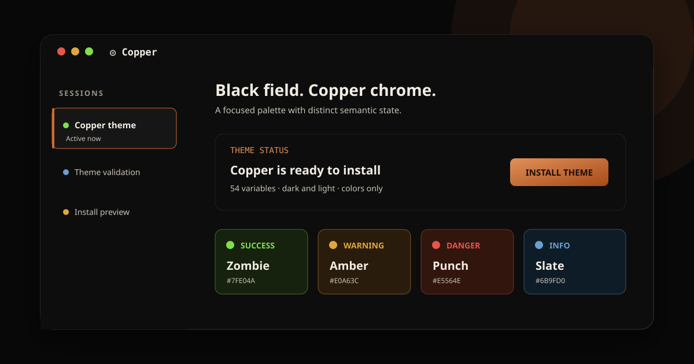

# Copper for KiroCrew



Copper is a high-contrast KiroCrew theme with a near-black canvas, warm copper chrome, and clear semantic colors. Copper is reserved for brand and interaction, while green, amber, red, and slate blue communicate application state.

## Design

- **Near-black field:** neutral surfaces from `#080808` to `#161616`
- **Copper interaction:** `#D06A32` for accent, focus, hover, and chrome
- **Clear state vocabulary:** zombie green for success, amber-gold for warning, punchy red for danger, and slate blue for information
- **Readable secondary text:** high-contrast muted foregrounds in both modes
- **Dark and light palettes:** complete 54-token KiroCrew theme contract

## Install

1. Clone or download this repository.
2. Open KiroCrew.
3. Go to **Settings > Display > Install theme**.
4. Select the repository folder containing `theme.json` and `variables.json`.
5. Choose **Copper** and reload KiroCrew if the palette does not refresh immediately.

## Validate

The validator uses only the Python standard library:

```sh
python3 scripts/validate.py
```

It checks the manifest, exact variable contract, safe CSS value forms, matching dark and light keys, and foreground contrast.

## Files

- `theme.json`: KiroCrew theme manifest
- `variables.json`: dark and light CSS variable maps
- `preview.svg`: palette and interface preview
- `scripts/validate.py`: dependency-free structural and contrast validator

## Notes

This is an unofficial community theme for KiroCrew. It changes colors only and does not include CSS overrides or executable code.

## License

[MIT](LICENSE)
